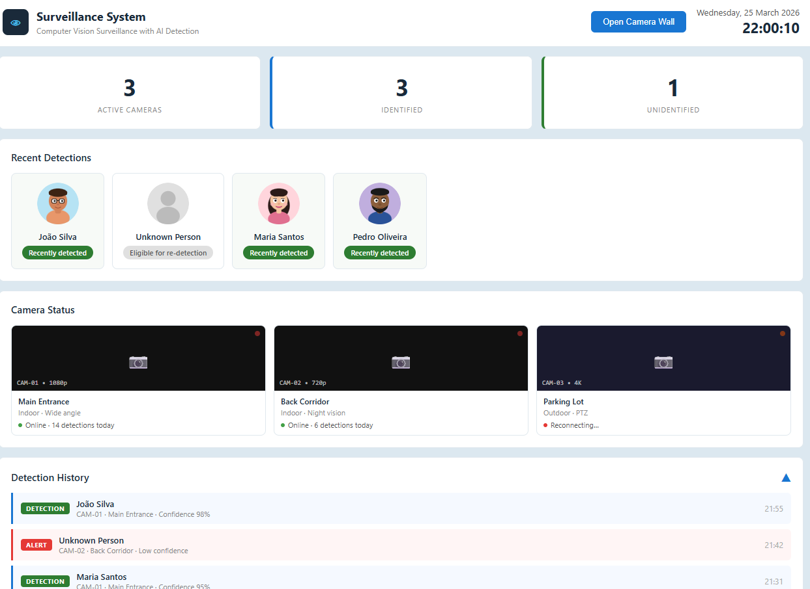

# surveillance-system
Computer vision surveillance with AI detection, real-time person detection, face recognition, and a web dashboard.
It was iterated in a vibe-coding workflow.



## Built With
| Library | Role |
|---|---|
| [Ultralytics YOLOv8](https://github.com/ultralytics/ultralytics) | Real-time person detection |
| [DeepFace](https://github.com/serengil/deepface) | Face recognition and embedding generation |
| [OpenCV](https://github.com/opencv/opencv-python) | Frame capture, decoding, and image processing |
| [Flask](https://github.com/pallets/flask) | Web server and REST API |
| [Waitress](https://github.com/Pylons/waitress) | Production WSGI server |
| [NumPy](https://github.com/numpy/numpy) | Numerical operations on embeddings |
| [SciPy](https://github.com/scipy/scipy) | Cosine distance for similarity matching |
| [Pillow](https://github.com/python-pillow/Pillow) | Image loading and preprocessing |
| [TF-Keras](https://github.com/keras-team/keras) | Backend for DeepFace model inference |

## Features
- Real-time person detection via YOLO on multi-camera RTSP streams
- Face recognition pipeline with DeepFace embeddings (Facenet512, ArcFace, ensemble)
- Per-camera detection stats with cooldown-based deduplication
- Live dashboard with recent detections, camera status, and event history
- Configurable thresholds, frame skip, and worker threads
- Centralized logging with console/file/both modes

## Project Layout
```text
surveillance-system/
|- reference_faces/           # Reference images used for embeddings
|- src/
|  |- app.py                  # Flask app and API routes
|  |- camera_processing.py    # Camera ingest + YOLO detection
|  |- recognition.py          # Embedding + matching pipeline
|  |- logger.py               # Centralized application logger
|  |- utils.py                # Config loader
|- web/
|  |- templates/              # HTML templates
|  |- static/
|     |- css/                 # Styling
|     |- assets/              # Public assets (logo/avatar)
|- config.json                # Runtime configuration
|- run.py                     # Waitress production entrypoint
```

## Quick Start
1. Install dependencies:
```bash
pip install Flask>=3.0.0 waitress>=2.1.2 opencv-python>=4.8.0 ultralytics>=8.0.0 numpy>=1.24.0 deepface>=0.0.79 Pillow>=10.0.0 tf-keras>=2.16.0 scipy>=1.11.0
```
2. Review and update [config.json](config.json) with your local setup.
3. Start the server:
```bash
python run.py
```
4. Open:
- Dashboard: http://localhost:8080
- Camera wall: http://localhost:8080/camera

## Configuration Notes
- Server settings are under `server`.
- Camera definitions are under `cameras`.
- Recognition behavior is under `recognition`.
- Throughput and detection tuning is under `performance`.
- Logging behavior is under `logging`.

The default `config.json` is intentionally safe for public sharing:
- Localhost server binding by default
- Disabled example cameras
- Placeholder camera credentials
- No personal or production endpoints

## Reference Faces
Place your reference images in `reference_faces/` using one identity per file.
- Supported formats: `.jpg`, `.jpeg`, `.png`, `.webp`
- File name is used as the identity label
- Example: `Ada Lovelace.jpg`

**On startup, embeddings are generated/cached automatically.**

## Tested With
This system was validated on a simple LAN setup:
- **Network**: server and cameras on the same local network (Wi-Fi / Ethernet), no VPN or port-forwarding required
- **Stream protocol**: RTSP over the local network
- **Camera model**: TP-Link Tapo C200
- **Server**: standard consumer laptop running Windows
- **Stream format**: `rtsp://<user>:<pass>@<camera-ip>:554/stream1`

The recognition pipeline ran in real-time at the default `frame_skip: 5` setting with no dropped frames.
